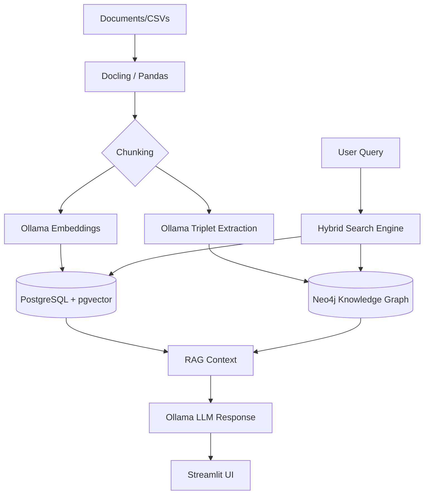

# 🌐 CompuMax Local Hybrid GraphRAG System 2025

A high-performance, local implementation of **GraphRAG** (Graph Retrieval-Augmented Generation) utilizing **Docling** for document parsing, **Neo4j** for relationship mapping, **PostgreSQL (pgvector)** for semantic search, and **Ollama** for local LLM inference.

## 🚀 Key Features

- **Hybrid Search**: Combines the precision of vector similarity (PostgreSQL) with the contextual depth of knowledge graphs (Neo4j).
- **Local First**: Privacy-focused architecture running entirely on your own infrastructure.
- **Intelligent Ingestion**: Uses `Docling`'s `HybridChunker` to respect document structure (headers, tables, paragraphs).
- **Interactive Visualization**: Real-time knowledge graph exploration directly in the web UI.
- **Clinical Dataset Demo**: Out-of-the-box support for clinical data simulations.

---

## 🏗️ Architecture



---

## 🛠️ Setup Instructions

### 1. Prerequisites
- [Docker Desktop](https://www.docker.com/products/docker-desktop/)
- [Ollama](https://ollama.ai/)
- Python 3.10+

### 2. Model Installation
Pull the required models via Ollama:
```bash
ollama pull gpt-oss:20b-cloud
ollama pull nomic-embed-text
```

### 3. Environment Configuration
1. Clone the repository and install dependencies:
   ```bash
   pip install -r requirements.txt
   ```
2. Copy `.env.example` to `.env` and adjust settings if necessary:
   ```bash
   cp .env.example .env
   ```
3. Start the database services:
   ```bash
   docker-compose up -d
   ```
4. Initialize database schemas:
   ```bash
   python db.py
   ```

---

## 📂 Usage

### Running the Web Application
```bash
streamlit run app.py
```

### Ingesting Demo Clinical Data
To populate the system with the included clinical dataset:
```bash
python ingest_clinical.py
```

### Utility Scripts
All maintenance scripts are located in the `scripts/` directory:
- `clear_db.py`: Wipe all data from Neo4j and PostgreSQL.
- `check_db_status.py`: Verify connectivity and record counts.

---

## 🧪 Technical Stack
- **Document Processing**: [Docling](https://github.com/DS4SD/docling)
- **Vector Store**: [PostgreSQL](https://www.postgresql.org/) + [pgvector](https://github.com/pgvector/pgvector)
- **Graph Database**: [Neo4j](https://neo4j.com/)
- **LLM/Embeddings**: [Ollama](https://ollama.com/)
- **UI Framework**: [Streamlit](https://streamlit.io/)

---
*Created by CompuMax - Advanced Agentic Coding 2025*

